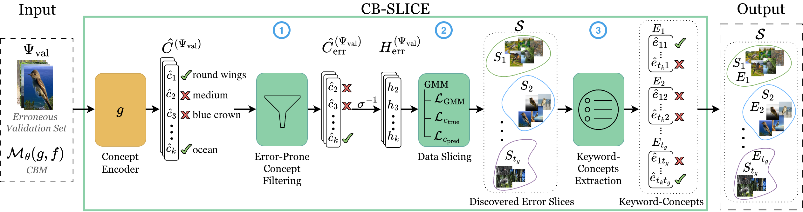

# CB-SLICE: Concept-Based Interpretable Error Slice Discovery

Official implementation of **CB-SLICE**, a concept-based error Slice Discovery Method (SDM) that groups
samples with shared concept prediction failures and identifies the keyword-concepts most responsible
for each slice's failure-mode.

> Yael Konforti, Mateo Espinosa Zarlenga, Elaf Almahmoud, Mateja Jamnik
> *Proceedings of the 43rd International Conference on Machine Learning (ICML), Seoul, South Korea.
> PMLR 306, 2026.*
> [arXiv:2605.29836](https://arxiv.org/abs/2605.29836) · `yk449@cam.ac.uk`

---

## Overview



<!-- TODO: export Figure 1 from the paper to assets/pipeline.png -->

CB-SLICE takes a trained Concept Bottleneck Model and the validation samples it mispredicts, and
returns a set of error slices, each described by the concepts responsible for it. It runs in three
steps: filter the concepts most implicated in downstream errors, cluster the erroneous samples in the
logit space of those concepts with a Gaussian Mixture Model, then extract the keyword-concepts that
best explain each resulting slice.

## How to use the code (TL;DR)?
1. Install the packages and dependencies from the file `environment.yml`.
2. Download the datasets described in the manuscript and update the `data_path` variable in `./configs/data/data_defaults.yaml`.
3. For Weights & Biases support, set mode to 'online' and adjust entity in `./configs/config.yaml`.
4. Train a CBM using train.py with the desired configuration of dataset and model from the `./configs/` folder.
5. Find the set of concepts with the highest expected change in the target prediction score (i.e., the concepts that are most likely contributing to the model's error) using analyze_erroneous_concepts.py script.
6. Fit a GMM model on the pre-trained CBM using train_gmm.py script.
7. Run quantitative and qualitative evaluation using baselines/test_concept_aware.py script.

---

## Code structure

```
configs/                         Hydra config tree (see "Configuration")
models/
  models.py                      DNN, CBM, MixtureGaussiansCBM
  layers.py                      MixtureGaussianLayer
  losses.py                      DNNLoss, CBLoss, GaussianMixtureLoss,
                                 ConceptErrorMixtureLoss
slice/                           slice evaluation and keyword extraction
train.py                         stage 1
analyze_erroneous_concepts.py    stage 2
train_gmm.py                     stage 3
environment.yml
```

### Models (`models/models.py`)

| Class | Role |
|---|---|
| `DNN` | Vanilla baseline. Encoder plus a class-logit head, no bottleneck. |
| `CBM` | Concept Bottleneck Model: a concept encoder followed by a label predictor. Supports hard, soft, autoregressive and embedding-based concept representations, and independent / sequential / joint training. |
| `MixtureGaussiansCBM` | Wraps a **pretrained** CBM and attaches a `MixtureGaussianLayer` over its concept logits. This is the model trained in stage 3; the CBM weights come from stage 1. |

### Layers (`models/layers.py`)

`MixtureGaussianLayer` is a differentiable Gaussian mixture implemented as an `nn.Module`, so it
trains by SGD alongside the rest of the network rather than being fitted post hoc. Learnable
parameters are the component means, diagonal variances and mixture weights. `init_params` seeds each
component's mean by sampling from a class-conditional normal when labels are available, falling back
to a global initialisation otherwise; mixture models are initialisation-sensitive and this is what
keeps components from collapsing onto one another. `forward` returns the per-component log joint
probabilities, shape `(batch_size, n_components)`.

### Losses (`models/losses.py`)

| Class | Used by |
|---|---|
| `DNNLoss` | `DNN`. Cross-entropy, binary or multi-class. |
| `CBLoss` | `CBM`. Concept loss (BCE or CE) plus task loss, weighted by `alpha` during joint training. |
| `GaussianMixtureLoss` | The mixture negative log-likelihood, computed in log space with the log-sum-exp trick and max subtraction. |
| `ConceptErrorMixtureLoss` | The full stage-3 objective: the mixture term plus concept and task terms under `lambda_c1`, `lambda_c2`, `lambda_t`. |

All loss classes return a **dict** of per-sample and per-concept components alongside the aggregate,
which is what the downstream slice analysis and the training diagnostics consume.

## Installation

```bash
git clone https://github.com/yaelkon/CB-SLICE.git
cd CB-SLICE
conda env create -f environment.yml # Edit the prefix to your .env directory
conda activate cb-slice   
```
Then download the datasets and set `root_data_path`.

---

## Configuration

Configs are composed by [Hydra](https://hydra.cc). `configs/config.yaml` is the root; `data/` and
`model/` are config groups you select on the command line. Each group has a `*_defaults.yaml` holding
the shared settings, and one small file per dataset or model that overrides only what differs.

```
configs/
  config.yaml                 root: experiment naming, seed, workers, W&B
  data/
    data_defaults.yaml        root_data_path
    CUB.yaml                  dataset name, num_classes, num_concepts
    ...                       one file per dataset
  model/
    model_defaults.yaml       backbone, training regime, optimiser, epochs
    CBM.yaml                  concept learning mode, concept loss
    ...                       one file per model variant
```

**Three things to edit before your first run.**

1. `configs/data/data_defaults.yaml` — point it at wherever you downloaded the datasets:

   ```yaml
   root_data_path: '/absolute/path/to/your/datasets/'
   ```

2. `configs/config.yaml` — W&B is `disabled` by default. To log runs, set your entity and project:

   ```yaml
   experiment_name: 'my_experiment'
   experiment_dir: './experiments/'
   seed: 42
   workers: 4

   logging:
     project: 'my-wandb-project'
     entity: 'my-wandb-entity'
     mode: 'online'          # online | offline | disabled
     experiment_name: 'my_experiment'
     debug_mode: False
     tags: ['waterbirds', 'joint']
   ```

   `debug_mode: True` suppresses all checkpoint and DataFrame writing, which is what you want while
   iterating.

3. For stage 3 only, set `model.pretrained_model_path` to the stage-1 checkpoint you want to attach
   the mixture to.

**Overriding from the command line.** Anything in the tree can be changed without editing a file:

```bash
# select config groups
python train.py +model=CBM +data=CUB

# override individual keys
python train.py +model=CBM +data=CUB model.learning_rate=0.001 logging.mode=disabled
```

---

## Quickstart

Run in order. Each step consumes the previous step's output directory.

```bash
# 1. Train the Concept Bottleneck Model
python train.py +model=CBM +data=CUB

# 2. Rank and filter the error-prone concepts
#    First set EXP_PATH inside the script to the config.yaml written by step 1
python analyze_erroneous_concepts.py

# 3. Fit the Gaussian mixture over the concept logits
#    Set model.pretrained_model_path to the step-1 checkpoint
python train_gmm.py +model=GMM +data=CUB \
    model.pretrained_model_path=./experiments/.../model_last.pth

# 4. Extract keyword-concepts and evaluate the discovered slices
python baselines/test_concept_aware.py
```
---

[//]: #Citation
[//]: #```bibtex
